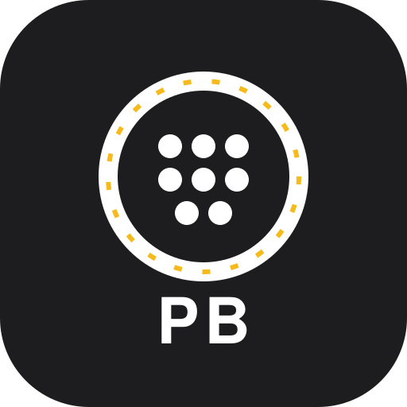

<div align="center">



# PB Gen

**Americano-style pickleball tournament generator.**<br>
Fair schedules where everyone rotates partners, faces new opponents, and sits out an equal share.

[**▶ Open the web app**](https://datakyle.github.io/PB-Gen/)

[](https://github.com/datakyle/PB-Gen/actions/workflows/pages.yml)
[](https://datakyle.github.io/PB-Gen/)
[](LICENSE)
[](web/)

</div>

---

## What is Americano?

Americano is a social doubles format built for mixed groups. Instead of fixed teams,
**players rotate partners every round** and are ranked individually on wins and point
differential. It keeps games competitive and sociable — but scheduling it by hand is
genuinely hard once you have more players than court space.

PB Gen does that scheduling for you.

## Features

- **Balanced pairing engine** — minimises repeat partnerships and repeat opponents.
- **Fair rest rotation** — with odd numbers, sit-outs are distributed evenly.
- **Live scoring** — record match scores; the leaderboard updates instantly.
- **Point-differential ranking** — sort by points, wins, losses, or rests.
- **Add rounds mid-tournament** — extend a session without losing history.
- **Multiple tournaments** — create, save, and switch between them.
- **Works offline** — everything runs locally in the browser; installable to a home screen.

## Repository layout

| Path | Description |
|---|---|
| [`web/`](web/) | The web app — static, dependency-free, deployed to GitHub Pages. |
| [`PB Gen/`](PB%20Gen/) | The original native iOS app (SwiftUI, MVVM). |
| [`.github/workflows/`](.github/workflows/) | CI: runs the test suite, then publishes `web/`. |

The web app is a port of the iOS app's scheduling core, so both share the same
tournament logic and scoring rules.

## Quick start

The web app needs no build step, bundler, or package install — just serve the folder:

```bash
git clone https://github.com/datakyle/PB-Gen.git
cd PB-Gen/web
python3 -m http.server 8000
```

Then open <http://localhost:8000>.

For the iOS app, open `PB Gen.xcodeproj` in Xcode and run the **PB Gen** scheme.

## Tests

The scheduling engine is pure logic with no DOM or storage dependencies, so it is
tested directly under Node:

```bash
node web/tests/engine.test.js
```

The suite sweeps **420 tournament configurations** (player counts 4–24, 1–5 courts,
1–8 rounds, multiple seeds) and asserts:

- every player plays or rests **exactly once** per round;
- match and rest counts are correct for the court/player combination;
- rests and games played stay balanced across a tournament;
- partnerships stay unique while unique pairings remain available;
- leaderboard arithmetic matches an independent calculation;
- the same seed always reproduces the same schedule.

CI runs this suite on every push and blocks deployment if it fails.

## How the scheduler works

Each round, the engine scores every player by how "owed" they are a game:

```
deficit = 0.4 · (1 − games played ÷ rounds)
        + 0.4 · (1 − unique partners ÷ possible partners)
        + 0.2 · (rounds since last played)
```

Players with the highest deficit are prioritised onto courts. When more players are
present than seats, sit-outs are chosen by who rested least recently, so rests stay
even. Teams are then formed by **backtracking search**, rejecting any pairing that has
already happened. Once every unique partnership has been used, the engine switches to a
repeat-tolerant mode that still avoids back-to-back repeats and favours the
least-used pairings.

Scoring is Americano-standard: the winning pair each take a win plus the **score margin**
added to their point differential, and the losing pair take a loss with that margin
subtracted. Standings rank by wins, then point differential.

Schedules are driven by a **seeded** random number generator, so a given tournament is
reproducible rather than different on every render.

## Design

The web interface follows Apple's design language — a parchment canvas with white
hairline cards, a single accent colour for every interactive element, SF Pro
typography with tight tracking, and pill-shaped controls. There are no decorative
gradients and no shadows on UI chrome; hierarchy comes from surface and type alone.
All touch targets meet the 44 pt minimum, and motion respects
`prefers-reduced-motion`.

## Deployment

Pushes to `main` that touch `web/` trigger the
[Pages workflow](.github/workflows/pages.yml): it runs the engine tests and, if they
pass, publishes `web/` to GitHub Pages at
**[datakyle.github.io/PB-Gen](https://datakyle.github.io/PB-Gen/)**.

Because the app is fully static, it can be hosted anywhere that serves files —
Netlify, Cloudflare Pages, S3, or any web server.

## License

[MIT](LICENSE) © kyle b.
